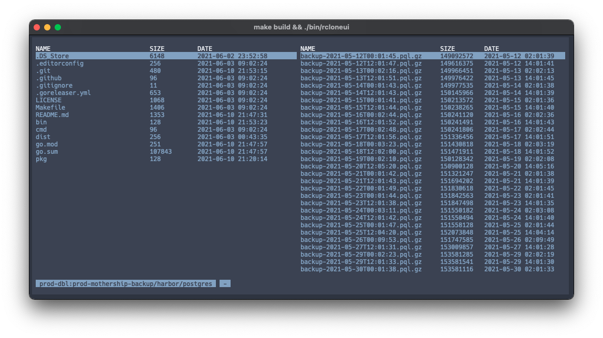

# rcloneui

rcloneui is a small terminal ui for [rclone](https://rclone.org) to view, copy and delete files from all remotes configured in your `rclone.conf` file.



## Usage

You can download rcloneui for your environment from the [releases](https://github.com/ricoberger/rcloneui/releases) page. Then extract the archive and run the `rcloneui` binary. To install the binary into your path you can use the following command:

```sh
sudo install -m 755 rcloneui /usr/local/bin/rcloneui
```

### Key Bindings

The following keys can be used for the navigation within the table and to switch between the two views.

| Key | Navigation |
| --- | ---------- |
| `j` or `down arrow` | Move down by one row .|
| `k` or `up arrow` | Move up by one row. |
| `g` or `home` | Move to the top. |
| `G` or `end` | Move to the bottom. |
| `Ctrl-F` or `page down` | Move down by one page. |
| `Ctrl-B` or `page up` | Move up by one page. |
| `Backspace` | Go back a folder. |
| `ESC` | Go to remotes overview. |
| `Tab` | Switch views. |

The following keys can be used to copy, paste or delete a file/folder.

| Key | Action |
| --- | ------ |
| `c` | Copy file. |
| `p` | Paste file. |
| `dd` | Delete file. |

## Development

To build and and run rcloneui from source you can use the following commands:

```sh
git clone git@github.com:ricoberger/rcloneui.git
cd rcloneui

make build
./bin/rcloneui
```
